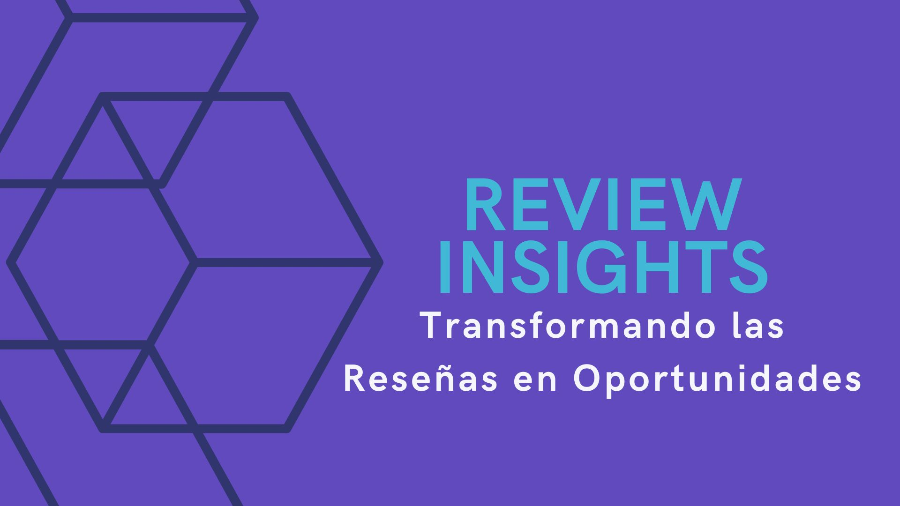
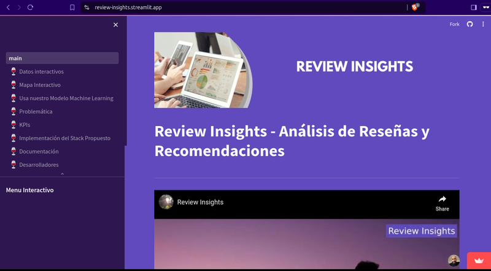

<!-- Centrar el saludo -->

  <strong>Hola y bienvenidos 👋</strong>

<!-- Imagen de portada -->

  

<!-- Línea divisoria -->
---

<!-- Descripción personal breve -->
Soy un **Data Scientist** apasionado por **Machine Learning**, **Power BI** y **análisis de datos**. Me encanta transformar datos en soluciones prácticas y resultados concretos. Además, disfruto compartir conocimientos impartiendo clases de ciencia de datos para inspirar a otros a aprovechar el poder de los datos.

<!-- Habilidades destacadas mediante badges -->

  
  
  
  

<!-- Línea divisoria -->
---

## Algunos proyectos

<!-- Proyecto 1 -->

  <!-- Imagen que enlaza al repositorio o página del proyecto -->
  
  <!-- Espacio entre imágenes -->
  &nbsp;&nbsp;&nbsp;&nbsp;
  <!-- Imagen que enlaza al video relacionado -->
  

**Review Insights**  
Review Insights es una empresa de análisis de datos que tiene como objetivo proporcionar información valiosa a otras empresas sobre las reseñas y recomendaciones que reciben de los usuarios en plataformas como Yelp y Google Maps. Nuestro enfoque principal es recopilar, analizar y ofrecer información significativa sobre las experiencias de los usuarios en diferentes comercios.

<!-- Proyecto 2 -->

  
  &nbsp;&nbsp;&nbsp;&nbsp;
  

**Nombre del Proyecto 2**  
Descripción breve del proyecto 2.

<!-- Repite la estructura para más proyectos -->

<!-- Línea divisoria -->
---

## Algunos videos de mi canal de YouTube

|  |  |  |  |
|---|---|---|---|

